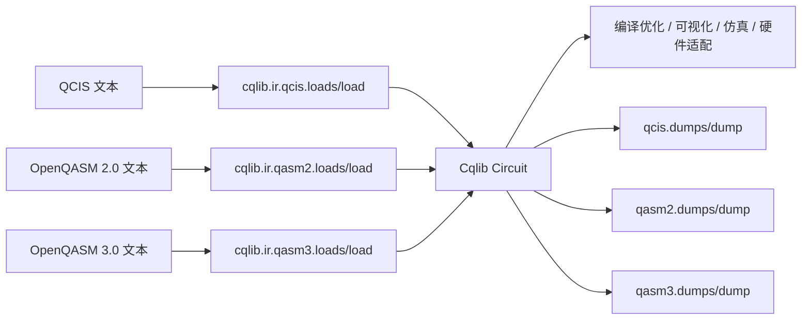

# IR 中间表示总览

IR（Intermediate Representation，中间表示）负责把 Cqlib 内部的 `Circuit` 电路对象和外部文本格式连接起来。它不是一个单独的算法模块，而是量子程序在“构建、保存、跨框架交换、硬件提交、调试复现”之间流转的协议层。

从用户视角看，IR 模块主要解决四类问题：

- 将 Cqlib 构建的 `Circuit` 导出为标准或硬件相关的文本格式。
- 将外部工具生成的量子线路文本导入为 Cqlib `Circuit`。
- 在 QCIS、OpenQASM 2.0、OpenQASM 3.0 之间做格式转换。
- 为后续编译优化、可视化、仿真、硬件适配提供统一入口。

## 1. Cqlib 的 IR 工作模型

Cqlib 的内部核心对象是 `Circuit`。外部文本格式（例如 QCIS 或 OpenQASM）不会绕过 `Circuit` 直接进入模拟器或编译器，而是先被解析成 `Circuit`，后续所有模块都基于同一套电路对象工作。



这意味着 IR 的核心语义是：

- `load/loads`：外部文本格式转换为 `Circuit`。
- `dump/dumps`：`Circuit` 转换为外部文本格式。
- 格式转换本质上是 `格式 A -> Circuit -> 格式 B`。
- 如果某个外部格式表达能力不足，导出时会返回明确错误，而不是静默丢失语义。

## 2. 支持的格式

| 格式 | Python 模块 | 主要用途 | 适合场景 | 注意事项 |
|---|---|---|---|---|
| QCIS | `cqlib.ir.qcis` | 面向硬件控制指令的线路文本 | 国产量子硬件接入、低层指令交换、QCIS 文件解析 | 表达能力偏硬件指令层，不适合复杂经典控制流 |
| OpenQASM 2.0 | `cqlib.ir.qasm2` | 经典量子汇编标准 | 标准线路文件、基准线路、旧版 OpenQASM 工具链互通 | 经典语义有限，主要支持 `if (creg == int) qop` |
| OpenQASM 3.0 | `cqlib.ir.qasm3` | 现代量子程序文本格式 | 动态线路、测量赋值、经典变量、控制流、现代 OpenQASM 工具链互通 | 支持子集以 Cqlib `Circuit` 可表达能力为边界 |

## 3. 统一 API

三个 IR 子模块都采用同一套 API 命名：字符串用 `loads/dumps`，文件用 `load/dump`。

| 函数 | 输入 | 输出 | 用途 |
|---|---|---|---|
| `loads(text)` | 格式文本字符串 | `Circuit` | 从字符串解析电路 |
| `load(path)` | 文件路径 | `Circuit` | 从文件解析电路 |
| `dumps(circuit)` | `Circuit` | 字符串 | 将电路导出为文本 |
| `dump(circuit, path)` | `Circuit`、文件路径 | `None` | 将电路写入文件 |

示例：

```python
from cqlib import Circuit
from cqlib.ir import qasm2, qasm3, qcis

circuit = Circuit(2)
circuit.h(0)
circuit.cx(0, 1)

qasm2_text = qasm2.dumps(circuit)
qasm3_text = qasm3.dumps(circuit)
qcis_text = qcis.dumps(circuit)

restored = qasm3.loads(qasm3_text)
print(restored.num_qubits)
```

## 4. Cqlib IR 的测量与经典数据模型

Cqlib 的 `Circuit` 支持动态线路，因此测量不是简单的“画一个测量门”。内部会区分两类经典数据：

| 概念 | 含义 | 常见来源 | 是否用户可写 |
|---|---|---|---|
| `ClassicalValue` | 测量产生的不可变临时结果 | `circuit.measure()`、`measure_bits()` | 否 |
| `ClassicalVar` | 用户可变经典存储 | `circuit.var(...)` | 是 |

例如：

```python
from cqlib import Circuit
from cqlib.circuit import ClassicalType

circuit = Circuit(2)

# 只产生一个测量结果值，不指定用户变量。
measurement = circuit.measure(0)

# 创建用户可见的 classical bit，并把测量结果写入其中。
bit = circuit.var(ClassicalType.bit())
circuit.measure_into(1, bit)
```

导出为 OpenQASM 时，Cqlib 会尽量把内部测量值折叠为目标格式的自然写法：

| Cqlib 操作 | OpenQASM 3 输出倾向 |
|---|---|
| `measure_into(q, bit)` | `c0 = measure q[0];` |
| `measure_bits_into([0, 1], bitvec)` | `c0 = measure q;` |
| 裸测量 `measure(q)` | 生成 `bit[n] meas;` 并写入 `meas[i]`，保证文本可读回 |
| 部分寄存器测量 | 输出 `c0[i] = measure q[j];` 形式，保留顺序 |

这部分是 Cqlib 当前 IR 修改的重点之一：导出 QASM3 时不会再把内部临时值直接暴露成无意义的 `v0/v1`，而是生成可读回、语义明确的测量目标。

## 5. 选择哪种格式

| 目标 | 推荐格式 | 原因 |
|---|---|---|
| 与公开数据集或通用工具互通 | OpenQASM 2.0 或 3.0 | 生态通用，工具支持多 |
| 表达现代动态线路、测量赋值、经典变量 | OpenQASM 3.0 | 语义比 2.0 完整 |
| 面向硬件指令或 QCIS 文件交付 | QCIS | 更接近硬件指令格式 |
| 只是保存简单线路并被旧工具读取 | OpenQASM 2.0 | 简单稳定 |
| 保留 Cqlib 特有动态语义 | 优先 OpenQASM 3.0 | 表达能力更接近 `Circuit` |

## 6. 推荐学习顺序

1. 先阅读 [QCIS 支持](1_qcis.md)，理解硬件指令风格文本。
2. 再阅读 [OpenQASM 2.0 支持](2_qasm2.md)，掌握最常见的标准格式。
3. 然后阅读 [OpenQASM 3.0 支持](3_qasm3.md)，理解测量、经典变量和动态线路。
4. 最后阅读 [格式转换工作流](4_conversion_workflow.md)，学习如何做跨格式互通和验证。
