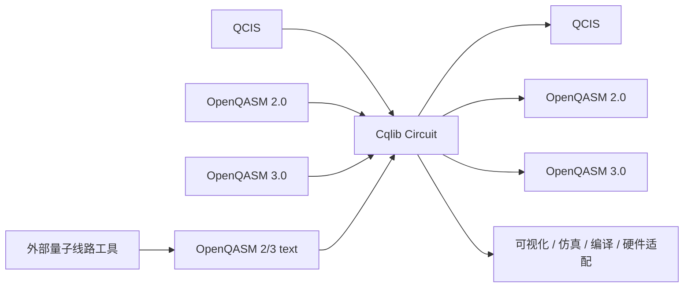

# 格式转换工作流

Cqlib 的 IR 模块可以作为 QCIS、OpenQASM 2.0、OpenQASM 3.0 和外部框架之间的转换中枢。所有转换都遵循同一个原则：

```text
外部格式 A -> Cqlib Circuit -> 外部格式 B
```

也就是说，转换不是字符串替换，而是先把输入格式解析为结构化 `Circuit`，再由目标格式导出器重新生成文本。

## 1. 转换总览



## 2. QCIS 转 OpenQASM 3.0

适用场景：把硬件侧或已有 QCIS 文件转换为现代标准格式，供文档系统、测试工具或其他 OpenQASM 工具消费。

```python
from cqlib.ir import qcis, qasm3

qcis_code = """
H Q0
CX Q0 Q1
M Q0 Q1
"""

circuit = qcis.loads(qcis_code)
qasm3_text = qasm3.dumps(circuit)
print(qasm3_text)
```

典型输出：

```text
OPENQASM 3.0;
include "stdgates.inc";

qubit[2] q;
bit[2] meas;

h q[0];
cx q[0],q[1];
meas[0] = measure q[0];
meas[1] = measure q[1];
```

这里 `meas` 是 Cqlib 为 QCIS 测量补充的显式 classical register。QCIS 没有测量赋值语法，但 QASM3 有，所以导出器会生成可读回的目标寄存器。

## 3. OpenQASM 3.0 转 QCIS

适用场景：把标准 QASM3 线路转换为硬件相关 QCIS 指令。

```python
from cqlib.ir import qasm3, qcis

qasm3_code = """
OPENQASM 3.0;
include "stdgates.inc";

qubit[2] q;
h q[0];
cz q[0],q[1];
"""

circuit = qasm3.loads(qasm3_code)
qcis_text = qcis.dumps(circuit)
print(qcis_text)
```

输出：

```text
H Q0
CZ Q0 Q1
```

如果 QASM3 中包含 QCIS 无法表达的控制流、自定义门、复杂 classical assignment 或非目标门集，需要先做分解或编译映射。

## 4. OpenQASM 2.0 转 OpenQASM 3.0

适用场景：升级老格式线路，或者把 QASM2 benchmark 转成 QASM3 便于表达后续动态测量逻辑。

```python
from cqlib.ir import qasm2, qasm3

qasm2_code = """
OPENQASM 2.0;
include "qelib1.inc";
qreg q[2];
h q[0];
cx q[0],q[1];
"""

circuit = qasm2.loads(qasm2_code)
qasm3_text = qasm3.dumps(circuit)
print(qasm3_text)
```

## 5. OpenQASM 3.0 转 OpenQASM 2.0

适用场景：需要输出给只支持 QASM2 的旧工具。

```python
from cqlib.ir import qasm3, qasm2

qasm3_code = """
OPENQASM 3.0;
include "stdgates.inc";

qubit[2] q;
h q[0];
cx q[0],q[1];
"""

circuit = qasm3.loads(qasm3_code)
qasm2_text = qasm2.dumps(circuit)
print(qasm2_text)
```

注意：只有当 QASM3 线路使用的特性也能被 QASM2 表达时，转换才会成功。复杂 `if/else`、`for`、`switch`、通用 classical assignment 等通常不能无损转成 QASM2。

## 6. 外部工具与 Cqlib 的通用转换方式

外部量子线路工具只要能够导入或导出 OpenQASM 文本，就可以按同一方式与 Cqlib 交换线路：

```text
外部线路对象 -> OpenQASM 文本 -> cqlib.ir.qasm2/qasm3.loads -> Cqlib Circuit
```

```text
Cqlib Circuit -> cqlib.ir.qasm2/qasm3.dumps -> OpenQASM 文本 -> 外部线路对象
```

推荐把 OpenQASM 文本作为工具边界，而不是直接耦合双方内部线路对象。这样可以降低依赖复杂度，也便于在 CI 中保存输入输出文件并做回归测试。

如果外部工具无法读取某些 Cqlib 扩展门，可以先在 Cqlib 侧把线路分解为更基础的门集，再导出。

## 7. 转换后验证

转换完成后建议做三类验证。

### 7.1 结构检查

```python
print(circuit.num_qubits)
print(len(circuit.operations))
```

### 7.2 可视化检查

```python
from cqlib.visualization import draw_text

print(draw_text(circuit))
```

### 7.3 小规模酉等价检查

对不含测量和动态控制的小线路，可以比较矩阵：

```python
import numpy as np
from cqlib.ir import qasm3

before = circuit.to_matrix()
restored = qasm3.loads(qasm3.dumps(circuit))
after = restored.to_matrix()

assert np.allclose(before, after)
```

含测量或控制流的线路不适合直接比较整体酉矩阵，应改为检查操作序列、测量目标、采样结果或后端执行结果。

## 8. 格式选择策略

| 输入来源 | 目标 | 推荐路线 |
|---|---|---|
| QCIS 文件 | 通用 OpenQASM 文档或测试文件 | `qcis.load -> qasm3.dump` |
| 外部线路工具 | Cqlib 仿真或编译 | `外部工具导出 OpenQASM -> cqlib.qasm2/qasm3.loads` |
| Cqlib 线路 | 老工具链 | `qasm2.dumps` |
| Cqlib 线路 | 现代工具链或动态线路 | `qasm3.dumps` |
| Cqlib 线路 | 硬件指令交付 | 先编译到目标门集，再 `qcis.dumps` |

## 9. 转换前检查清单

导出前建议确认：

- 线路中是否包含目标格式不支持的门。
- 是否存在未绑定参数。
- 是否包含复杂 classical control flow。
- 是否需要先 `decompose()` 自定义门。
- 是否需要先做硬件拓扑映射或目标门集分解。
- 是否需要保留测量结果，或者只是单纯绘图/仿真。

示例：

```python
compiled = circuit.decompose()
text = qasm3.dumps(compiled)
```

## 10. 常见转换问题

| 问题 | 根本原因 | 建议 |
|---|---|---|
| QCIS 转 QASM3 后多了 `bit[n] meas` | QCIS 没有 classical 赋值，QASM3 需要显式测量目标以保证可读回 | 正常行为，不需要删除 |
| QASM3 转 QASM2 失败 | QASM3 使用了 QASM2 无法表达的动态语义 | 保持 QASM3，或简化线路 |
| 外部工具读取 Cqlib 导出的 OpenQASM 失败 | 目标工具不支持某些扩展门或语法子集 | 先分解为基础门，或改用目标工具支持的格式 |
| QCIS 导出失败 | 线路包含 QCIS 不支持的门、Unitary、控制流或普通 identity | 先编译/分解到 QCIS 支持门集 |
| 转换后文本和原文本不一样 | 导出器会规范化文本，不保留排版和变量名 | 以线路语义为准，不以字符串完全一致为准 |

## 11. 推荐工程实践

- 在项目中保留源格式和目标格式，便于追溯。
- 对关键格式转换加入单元测试，至少覆盖 `loads -> dumps -> loads`。
- 对简单酉线路使用矩阵等价性验证。
- 对含测量线路检查测量顺序和 classical target。
- 对硬件提交路径，先用小线路验证门集、qubit 编号和测量输出。

## 下一步

- [IR 中间表示总览](0_overview.md)
- [QCIS 支持](1_qcis.md)
- [OpenQASM 2.0 支持](2_qasm2.md)
- [OpenQASM 3.0 支持](3_qasm3.md)
