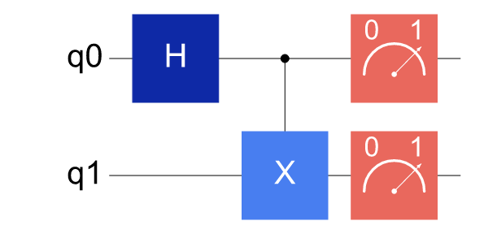
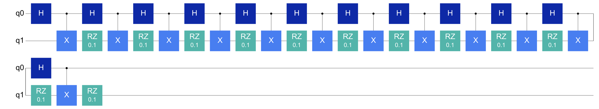
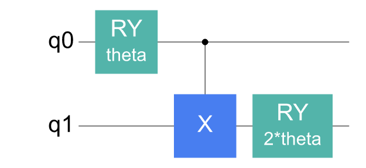
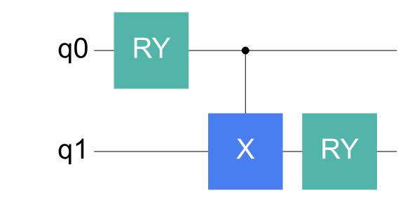
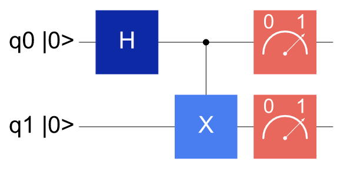
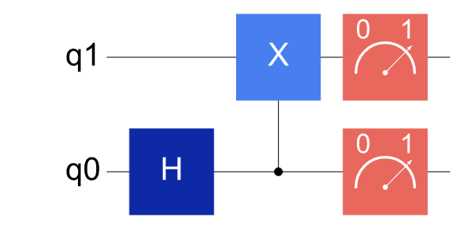
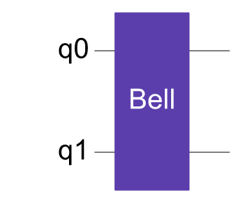
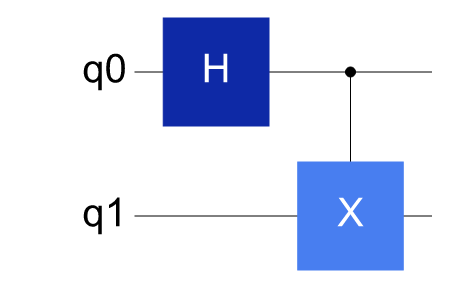

# 生成 PNG 线路图

PNG 线路图适合 Gitee、Markdown、Notebook、网页文档、报告和演示材料。与文本图相比，图形线路更适合展示较复杂的结构；需要矢量图时，也可以把导出后缀改成 `.svg`。

---

## 任务：保存一张 Bell 态线路图

```python
from cqlib import Circuit
from cqlib.visualization import draw_figure

circuit = Circuit(2)
circuit.h(0)
circuit.cx(0, 1)
circuit.measure(0)
circuit.measure(1)

svg = draw_figure(circuit, output_path="assets/bell.png")
print(svg[:80])
```

生成结果如下：



`draw_figure` 返回 SVG 字符串，同时在传入 `output_path` 时写入文件。`output_path` 使用 `.png` 后缀时会写出 PNG 文件，生成的 `assets/bell.png` 可以直接放入 Markdown、HTML、PPT 或论文素材目录。

```markdown

```

---

## 在 Notebook 中内联显示

在 Notebook 中，`draw_figure(circuit)` 可以作为单元格最后一行直接显示。

```python
from cqlib.visualization import draw_figure

draw_figure(circuit)
```

需要显式控制显示时，可以交给 IPython：

```python
from IPython.display import SVG, display

display(SVG(draw_figure(circuit)))
```

如果同一段 Notebook 既用于探索又用于沉淀实验记录，建议始终显式传入 `output_path`。这样 Notebook 中看到的图和 Markdown 中引用的 PNG 来自同一段代码。

---

## 折叠长线路

当线路较深时，直接平铺会让图片过宽。可以用 `fold` 控制图形折行。

```python
deep = Circuit(2)
for _ in range(12):
    deep.h(0)
    deep.cx(0, 1)
    deep.rz(1, 0.1)

draw_figure(deep, fold=20, output_path="assets/deep_folded.png")
```

折叠后的线路图如下：



折叠只改变画布排版，不改变线路执行顺序。阅读折叠图时，沿每一段末尾和下一段开头的连接方向继续读即可。


---

## 控制图中的信息密度

参数化线路在图中显示全部表达式时，可能会影响阅读。

```python
from cqlib import Circuit, Parameter
from cqlib.visualization import draw_figure

theta = Parameter("theta")

ansatz = Circuit(2)
ansatz.ry(0, theta)
ansatz.cx(0, 1)
ansatz.ry(1, 2 * theta)

draw_figure(ansatz, output_path="assets/ansatz_with_params.png")
draw_figure(ansatz, show_params=False, output_path="assets/ansatz_structure.png")
```

保留参数的图：



隐藏参数后的结构图：



---

## 展示初态和比特顺序


```python
draw_figure(circuit, initial_state=True, output_path="assets/bell_initial_state.png")
```

带初态标记的图如下：



需要与后端、论文图或其他框架的显示习惯对齐时，可以反转显示顺序：

```python
draw_figure(circuit, reverse_bits=True, output_path="assets/bell_reverse_bits.png")
```

反转显示顺序后的图如下：



这两个选项只影响图形展示，不改变 `Circuit` 的门顺序、比特索引或测量语义。

---

## 展开复合门用于排查

复合门保留模块边界，适合讲解算法结构；展开复合门则适合排查底层门序列。

```python
block = Circuit(2)
block.h(0)
block.cx(0, 1)
bell_gate = block.to_gate("Bell")

main = Circuit(2)
main.append_circuit_gate(bell_gate, [0, 1])

draw_figure(main, output_path="assets/bell_gate.png")
draw_figure(
    main,
    decompose_circuit_gates=True,
    output_path="assets/bell_gate_decomposed.png",
)
```

保留复合门边界的图：



展开复合门后的图：



---

## 下一步

- [Notebook 与文档集成](3_notebook_and_docs.md)：把图片生成路径、资源目录和 Markdown 引用固定下来。
- [复杂线路的可视化策略](4_visualization_practices.md)：用分阶段图片、模块边界和映射前后对比展示更大的线路。
- [控制流与特殊线路结构](5_control_flow_and_special.md)：阅读包含分支、循环、`reset`、`delay` 和自定义门的线路图。
