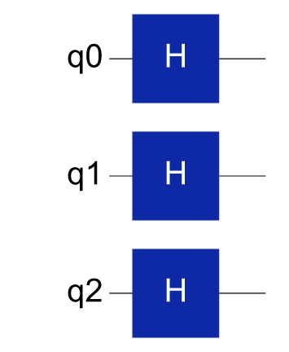
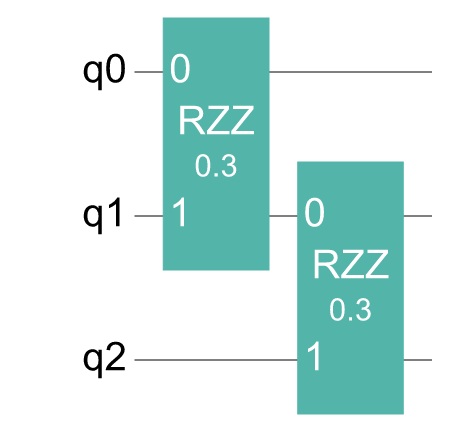
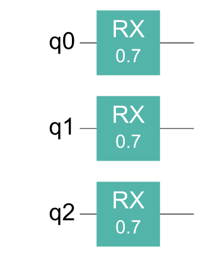
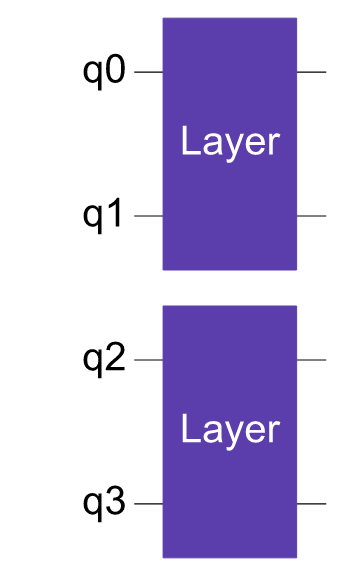
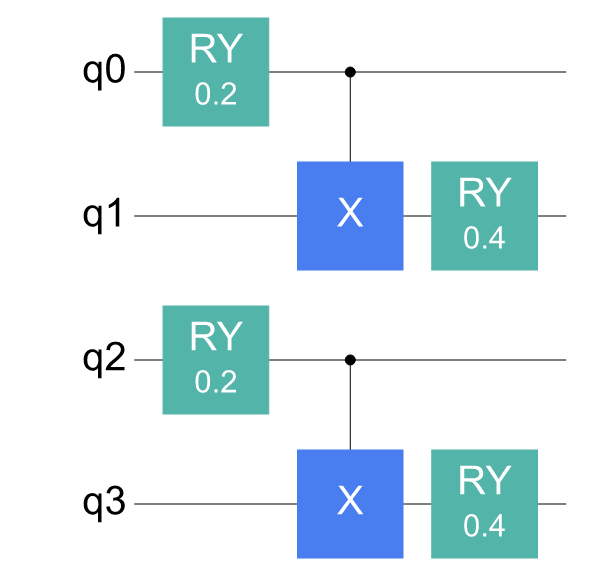
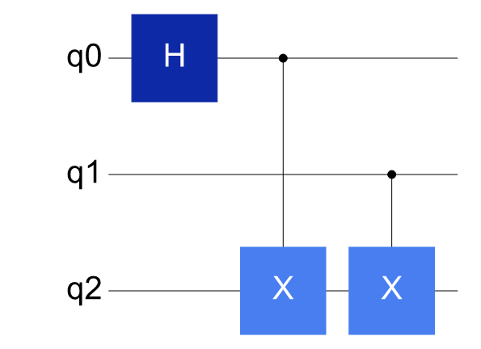
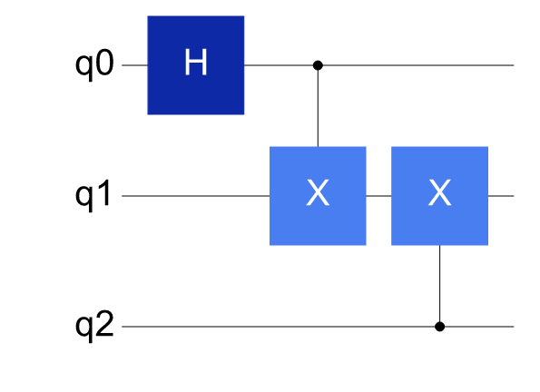

# 复杂线路的可视化策略

当线路规模变大时，直接绘制全线路可能不易阅读。更实用的方式是先查看关键结构，再用少量图形对比规模扩展、模块展开或编译映射前后的变化。

---

## 任务：分阶段展示一个 QAOA 风格线路

先把线路拆成状态制备、问题层和 mixer 层：

```python
from cqlib import Circuit
from cqlib.visualization import draw_figure, draw_text

prepare = Circuit(3)
for q in range(3):
    prepare.h(q)

cost = Circuit(3)
cost.rzz(0, 1, 0.3)
cost.rzz(1, 2, 0.3)

mixer = Circuit(3)
for q in range(3):
    mixer.rx(q, 0.7)
```

先分别绘制每一段，便于检查状态制备、问题层和 mixer 层是否各自正确。

```python
print(draw_text(prepare))
print(draw_text(cost))
print(draw_text(mixer))

draw_figure(prepare, output_path="assets/qaoa_prepare.png")
draw_figure(cost, output_path="assets/qaoa_cost.png")
draw_figure(mixer, output_path="assets/qaoa_mixer.png")
```

状态制备层：



问题层：



Mixer 层：



完整 QAOA 线路可以由这些模块按层重复组成。先检查单层结构，再扩展层数，可以更早发现门顺序或作用比特错误。

---

## 展示模块边界，再展示展开细节

对于 ansatz、oracle、特征映射等可复用模块，通常先保留 `CircuitGate` 边界。

```python
block = Circuit(2)
block.ry(0, 0.2)
block.cx(0, 1)
block.ry(1, 0.4)
block_gate = block.to_gate("Layer")

ansatz = Circuit(4)
ansatz.append_circuit_gate(block_gate, [0, 1])
ansatz.append_circuit_gate(block_gate, [2, 3])

draw_figure(ansatz, output_path="assets/ansatz_modules.png")
draw_figure(
    ansatz,
    decompose_circuit_gates=True,
    output_path="assets/ansatz_decomposed.png",
)
```

保留模块边界的图：



展开模块后的图：



保留模块边界时，更容易看清 ansatz 的层级结构；展开复合门后，更容易检查底层门序列是否符合预期。

---

## 映射前后对比

编译和路由场景中，图的重点不是每个门的矩阵，而是 SWAP 是否被插入、双比特门是否满足拓扑约束。

```python
from cqlib.compile import compile
from cqlib.device import Device

original = Circuit(3)
original.h(0)
original.cx(0, 2)
original.cx(1, 2)

result = compile(original, device=Device.line("line-3", 3), seed=42)
mapped = result.circuit

print("before")
print(draw_text(original, line_width=100))

print("after")
print(draw_text(mapped, line_width=100))

draw_figure(original, output_path="assets/mapped_before.png")
draw_figure(mapped, output_path="assets/mapped_after.png")
```

映射前：

```text

 Q0: ───H──■────
           │
 Q1: ──────┼──■─
           │  │
 Q2: ──────X──X─

```



映射后：

```text

 Q0: ───H──■────
           │
 Q1: ──────X──X─
              │
 Q2: ─────────■─

```



对比映射前后的图时，重点检查是否增加了 SWAP、线路深度是否变大、逻辑比特和物理比特的关系是否需要记录。

如果映射结果依赖随机 seed、启发式搜索或设备拓扑，需要固定 seed，并记录示例使用的是哪种拓扑。真实硬件设备的校准、可用 qubit 和门错误率会随时间变化，不能把某一次映射结果当成永久保证。

---

## 大线路只展示关键切片

对于多层 ansatz 或自动生成线路，完整图通常过宽。可以用下面的组合方式查看关键切片：

```python
print("num operations:", len(ansatz))
print(draw_text(ansatz, show_params=False, line_width=100))

draw_figure(
    ansatz,
    show_params=False,
    fold=80,
    output_path="assets/ansatz_overview.png",
)
```

概览图如下：


同时记录一张小表：

| 内容 | 展示方式 |
|---|---|
| 单层结构 | PNG 线路图 |
| 层数、门数、深度 | 表格 |
| 编译前后差异 | 前后对比图 |
| 参数取值 | 单独表格或公式 |

这种方式比完整平铺几十层线路更容易定位问题，也更适合放入实验记录或技术报告。

---

## 可视化不能替代验证

可视化适合发现结构问题，但不能证明量子程序正确。关键线路仍应配合数值检查：

```python
from cqlib import Circuit
from cqlib.qis import Statevector

check = Circuit(2)
check.h(0)
check.cx(0, 1)

state = Statevector.from_circuit(check)
print(state.probabilities())
```

对于含随机采样的流程，还需要固定 seed 或使用容差判断。对于硬件执行流程，不能要求真实设备结果与理想模拟图完全一致，应在文档中说明 shot noise、拓扑映射、门误差和测量误差的影响。

因此，推荐组合是：小线路用文本图快速检查，关键结构保存 PNG，核心结论再用概率、矩阵或测试断言验证。可视化负责帮助检查结构，不负责单独证明算法正确。

---

## 下一步

- [控制流与特殊线路结构](5_control_flow_and_special.md)：把同样的读图方法用于动态控制流、非幺正指令和自定义门。
- [可视化执行结果](6_result_visualization.md)：在线路结构确认后，用 histogram 和 distribution 检查采样结果。
- [可视化量子态](7_state_visualization.md)：需要解释状态本身时，用 Bloch、state city 和 Pauli vector 补充结构图。
