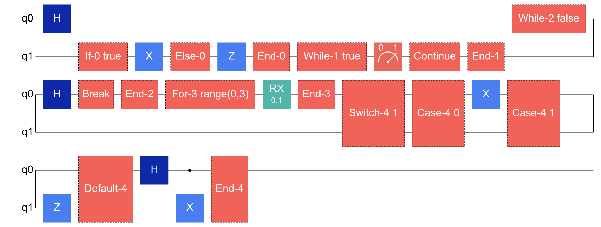
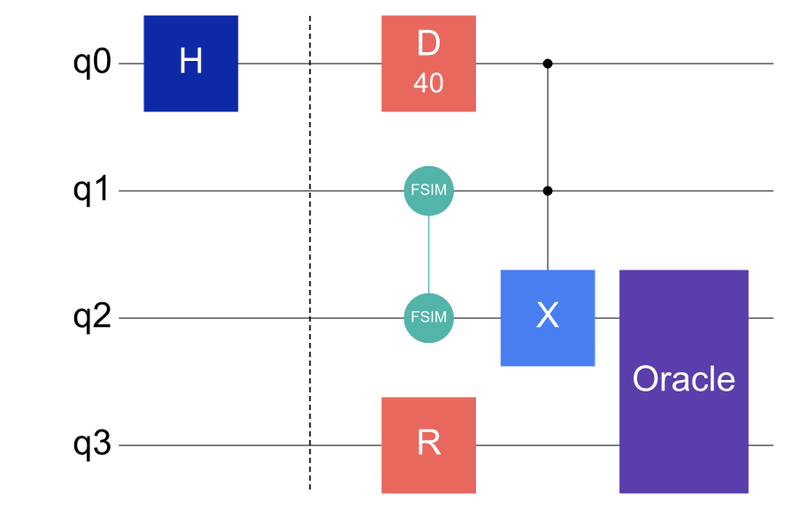

# 控制流与特殊线路结构

除了基础门和常规参数化线路，Cqlib 的线路图也可以显示动态控制流、非幺正指令和自定义门。遇到这类线路时，读图重点不只是门顺序，还包括控制流块覆盖了哪些 qubit lane、分支在哪里结束、循环中是否存在 `break` / `continue`，以及特殊门标签是否保留了算法含义。

以下示例只生成线路图，不执行真实硬件任务。

---

## 任务：阅读动态控制流图

先构造一条包含 `if/else`、`while`、`for`、`switch`、`break` 和 `continue` 的动态线路。为了让图中的控制流标签保持短而稳定，这里的读图示例使用字面量条件：

```python
from cqlib import Circuit
from cqlib.circuit import ClassicalExpr, ClassicalType
from cqlib.visualization import draw_figure

dynamic = Circuit(2)
dynamic.h(0)

def then_body(body):
    body.x(1)

def else_body(body):
    body.z(1)

dynamic.if_else(
    ClassicalExpr.bool_literal(True),
    then_body,
    else_body,
)

def continue_body(body):
    body.measure(1)
    body.continue_loop()

dynamic.while_(
    ClassicalExpr.bool_literal(True),
    continue_body,
)

def break_body(body):
    body.h(0)
    body.break_loop()

dynamic.while_(
    ClassicalExpr.bool_literal(False),
    break_body,
)

loop_var = dynamic.var(ClassicalType.uint(3))

def for_body(body, index):
    body.rx(0, 0.1)

dynamic.for_uint(
    loop_var,
    ClassicalExpr.uint_literal(3, 0),
    ClassicalExpr.uint_literal(3, 3),
    ClassicalExpr.uint_literal(3, 1),
    for_body,
)

def case_zero(body):
    body.x(0)

def case_one(body):
    body.z(1)

def switch_default(body):
    body.h(0)
    body.cx(0, 1)

def build_switch(builder):
    builder.value(0, case_zero)
    builder.value(1, case_one)
    builder.default(switch_default)

dynamic.switch(ClassicalExpr.uint_literal(2, 1), build_switch)

draw_figure(dynamic, fold=10, output_path="assets/dynamic_control_flow.png")
```

生成的控制流线路图如下：



阅读这张图时，可以按控制流块逐段检查：

- `If`、`Else` 和 `End` 标记给出条件分支的入口、备选分支和结束位置；
- 第一个 `While` 块使用 `true` 条件，循环体末尾的 `Continue` 表示进入下一次循环判断；
- 第二个 `While` 块包含 `Break`，表示循环体内部可以直接退出最近的循环；
- `For` 块会显示循环范围，便于确认迭代边界；
- `Switch` 块显示选择表达式，并列出 case 和 default 分支；
- 控制流块的竖向跨度对应 body 实际使用到的 qubit lane，未参与该 body 的 lane 不应被误读为被该控制块操作。

真实动态线路中的条件通常来自路中测量或 classical storage，写法如下：

```python
from cqlib import Circuit
from cqlib.circuit import ClassicalExpr, ClassicalType
from cqlib.compile import compile
from cqlib.device import Device

dynamic = Circuit(2)
dynamic.h(0)
measured = dynamic.measure(0)
condition = measured.expr().to_bool()

def then_body(body):
    body.x(1)

def else_body(body):
    body.z(1)

dynamic.if_else(condition, then_body, else_body)

keep_running = dynamic.var(ClassicalType.bool())
dynamic.store(keep_running, ClassicalExpr.bool_literal(True))

def loop_body(body):
    loop_measurement = body.measure(1)
    body.store(keep_running, loop_measurement.expr().to_bool())
    body.continue_loop()

dynamic.while_(keep_running.expr(), loop_body)

compiled = compile(dynamic, device=Device.line("line-2", 2), seed=42)
```

布局和路由会把控制流体作为结构化子线路处理，并递归处理 body 中的门和控制转移标记。线路图只表达结构、分支位置和控制流边界，不表达一次运行时实际走哪条路径，也不估计分支概率或循环次数。

---

## 任务：阅读特殊指令和非基础门

下面的线路同时包含 `barrier`、`delay`、`reset`、`fSim`、多控制门和自定义 `UnitaryGate`：

```python
from cqlib import Circuit
from cqlib.circuit import MCGate, StandardGate, UnitaryGate
from cqlib.visualization import draw_figure

special = Circuit(4)
special.h(0)
special.barrier([0, 1, 2, 3])
special.delay(0, 40.0)
special.fsim(1, 2, 0.21, -0.44)
special.reset(3)

special.append_mc_gate(MCGate(2, StandardGate.X), [0, 1, 2])
special.append_unitary_gate(UnitaryGate("Oracle", 2), [2, 3])

draw_figure(special, output_path="assets/special_directives_and_gates.png")
```

生成的线路图如下：



这张图可以帮助检查几类常见问题：

- `barrier` 是竖线，用于保留分段或调度边界，不表示量子门；
- `delay` 会显示等待时长，适合检查硬件时序或空闲段；
- `reset` 显示为重新置到 `|0>`，它是非幺正指令；
- `fSim` 是双比特参数门，图中会跨越两个作用 qubit；
- 多控制门按“控制位在前、目标位在后”的顺序绘制；
- 自定义 `UnitaryGate` 优先显示用户给出的 label，例如这里的 `Oracle`。

如果自定义门或复合门标签过长，图形仍然能显示结构，但阅读时应确认 label 是否足够表达算法模块含义。对于需要进入底层门序列排查的场景，可以回到 [生成 PNG 线路图](2_draw_figure.md) 中的 `decompose_circuit_gates=True` 示例。

---

## 下一步

- [生成 PNG 线路图](2_draw_figure.md)：回到基础绘图选项，调整折叠、参数显示、初态标记和复合门展开。
- [复杂线路的可视化策略](4_visualization_practices.md)：把控制流或特殊门放入更大的算法线路时，用分段和对比图保持可读性。
- [可视化执行结果](6_result_visualization.md)：运行或采样后，用结果图检查动态线路产生的 bitstring 分布。
