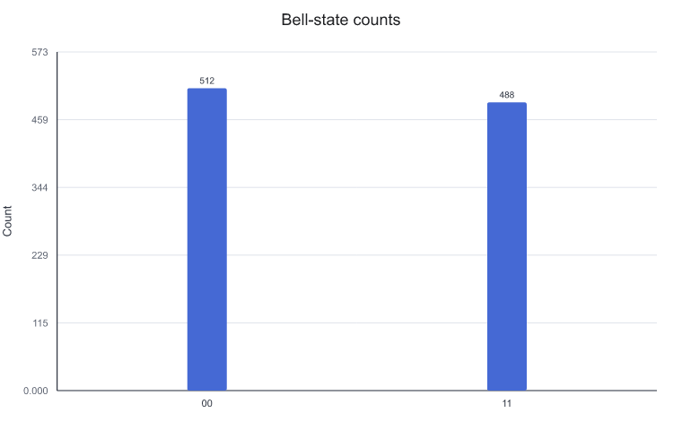
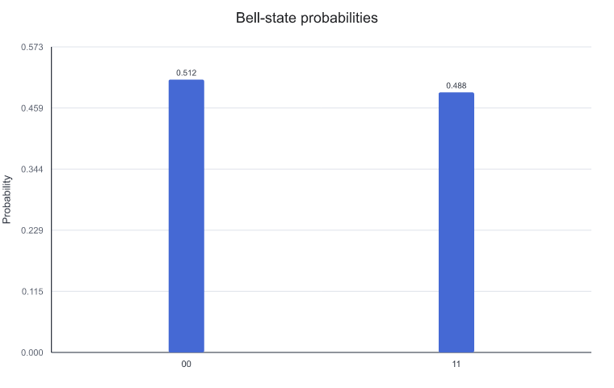
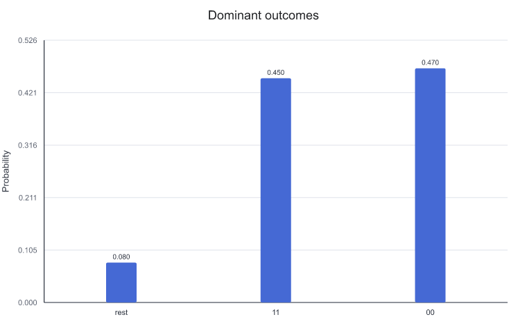
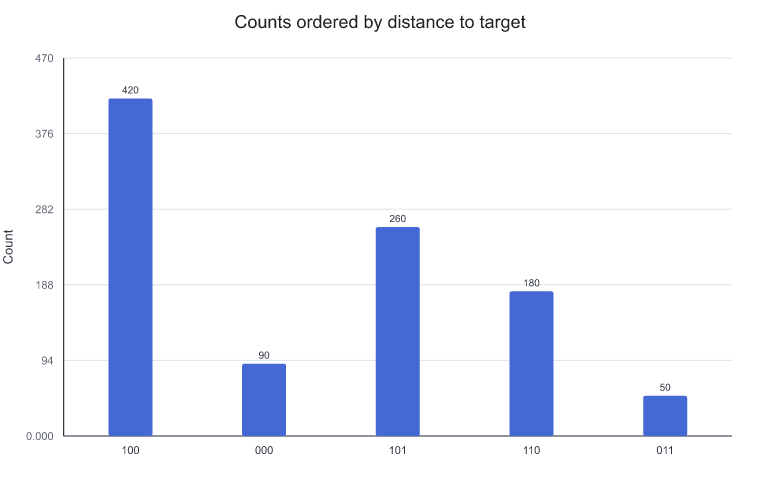
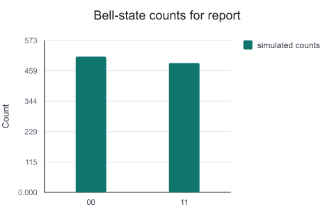

# 可视化执行结果

下面使用一个构造出的 `ExecutionResult` 展示如何绘制采样计数和归一化概率分布。

这里使用本地构造的结果对象，不连接云平台，也不提交真实硬件任务。

---

## 任务：查看 Bell 态采样结果

真实执行或模拟采样后，通常会得到 bitstring 到次数的映射。这里直接从 counts 构造结果对象，便于聚焦在结果图的阅读方式上。

```python
from cqlib.device import ExecutionResult
from cqlib.visualization import plot_distribution, plot_histogram

counts = {"00": 512, "11": 488}

result = ExecutionResult.from_counts(
    "bell-demo",
    [0, 1],
    sum(counts.values()),
    2,
    counts,
)
```

`counts` 表示 1000 次采样中只观察到 `00` 和 `11`。这里 bitstring 按结果对象的显示约定直接写入；如果结果来自硬件或其他 SDK，需要先确认测量位到 bitstring 的映射关系。对于理想 Bell 态，`00` 和 `11` 应是主峰，`01`、`10` 不应以高概率出现。

---

## 画原始计数柱状图

```python
plot_histogram(
    result,
    title="Bell-state counts",
    output_path="assets/bell_counts.png",
)
```

生成的计数图如下：



计数图适合展示真实 shot 数。比较不同 shot 设置、硬件任务或误差缓解前后的原始采样量时，优先使用 histogram。读图时先看主峰，再看是否存在本不应出现的 bitstring。

---

## 画概率分布

```python
plot_distribution(
    result,
    title="Bell-state probabilities",
    output_path="assets/bell_distribution.png",
)
```

生成的概率分布如下：



概率分布会把计数归一化，更适合与理论概率比较。对于 Bell 态，理想分布应接近：

```text
P(00) = 0.5
P(11) = 0.5
P(01) = 0.0
P(10) = 0.0
```

实验结果出现少量 `01` 或 `10` 时，不应立刻判断线路错误。需要结合 shot 数、噪声模型、测量误差和后端信息判断。

---

## 保留主峰并合并长尾

当只想保留出现次数最多的若干项时，可以限制展示数量。剩余项会合并，便于查看主峰。

```python
noisy_counts = {
    "00": 470,
    "11": 450,
    "01": 45,
    "10": 35,
}

noisy_result = ExecutionResult.from_counts(
    "bell-noisy-demo",
    [0, 1],
    sum(noisy_counts.values()),
    2,
    noisy_counts,
)

plot_distribution(
    noisy_result,
    number_to_keep=2,
    sort="desc",
    title="Dominant outcomes",
    output_path="assets/bell_dominant_outcomes.png",
)
```

只保留主峰后的图如下：



使用这种图时，需要确认被合并的结果是什么，以及是否会影响结论。`number_to_keep` 适合报告主峰结构，但不适合隐藏错误项；如果低概率项本身就是分析重点，应展示完整分布或单独列出被合并的 counts。

---

## 标记目标结果

调试搜索算法或分类任务时，常常需要强调某个目标 bitstring。可以用 `target_string` 标记目标项，并按 Hamming 距离排序。

```python
search_counts = {
    "100": 420,
    "101": 260,
    "110": 180,
    "000": 90,
    "011": 50,
}

search_result = ExecutionResult.from_counts(
    "search-demo",
    [0, 1, 2],
    sum(search_counts.values()),
    3,
    search_counts,
)

plot_histogram(
    search_result,
    sort="hamming",
    target_string="100",
    title="Counts ordered by distance to target",
    output_path="assets/search_hamming_counts.png",
)
```

目标结果排序后的图如下：



这类图适合检查“结果是否集中到目标附近”。使用前需要明确目标 bitstring 的定义和测量位顺序。

---

## 生成报告用结果图

当结果图需要放进报告或演示材料时，可以同时控制画布尺寸、颜色、图例和柱状标签显示。下面仍使用同一组 Bell 态 counts，只调整图形呈现方式：

```python
plot_histogram(
    result,
    figsize=(4.8, 3.2),
    color=["#0f766e"],
    legend=["simulated counts"],
    bar_labels=False,
    title="Bell-state counts for report",
    output_path="assets/bell_report_counts.png",
)
```

生成的报告用计数图如下：



这种设置适合图很多、版面空间有限的材料。关闭 `bar_labels` 后，图形更简洁；如果需要逐项复核具体 counts，应同时保留原始结果数据或使用带标签的默认图。

---

## 结果图检查要点

- 确认结果来自模拟、构造数据还是真实硬件；
- 记录 shot 数，不要只查看归一化概率；
- 对硬件结果保留误差和噪声解释，不要把偏差简单归因于线路错误；
- 与理论分布对比时，先确认 bitstring 顺序和测量映射；
- 正式报告中可以同时保存 PNG 图和原始 counts 数据。

---

## 下一步

- [可视化量子态](7_state_visualization.md)：需要解释模拟态本身时，用 Bloch、state city 和 Pauli vector 补充采样结果。
- [Notebook 与文档集成](3_notebook_and_docs.md)：把结果图、原始 counts 和图片引用一起保存到实验记录中。
- [复杂线路的可视化策略](4_visualization_practices.md)：把结果图和线路图并排检查，确认结构变化是否解释了分布变化。
