# 可视化量子态

状态图用于理解量子态本身，而不是测量采样结果。Cqlib 当前支持从 `Statevector` 或 `DensityMatrix` 绘制 Bloch multivector、state city 和 Pauli vector，也支持直接绘制单个 Bloch 向量。

以下示例都在本地模拟中完成，不涉及真实硬件。

---

## 任务：观察单比特叠加态

先构造一个 `|+>` 态：

```python
from cqlib.qis import Statevector
from cqlib.visualization import (
    plot_bloch_multivector,
    plot_bloch_vector,
    plot_state_city,
    plot_state_paulivec,
)

state = Statevector(1)
state.apply_h(0)
```

`|+>` 态在 Bloch 球上位于 X 轴正方向，因此可以用 Bloch 图快速检查状态制备是否符合预期。这里的状态对象来自本地 `Statevector`，不是采样 counts。

```python
plot_bloch_multivector(
    state,
    title="|+> state",
    output_path="assets/plus_bloch.png",
)
```

生成的 Bloch 图如下：

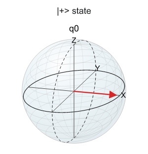

绘制手动给出的 Bloch 向量时，可以直接传入三维向量：

```python
plot_bloch_vector(
    [1.0, 0.0, 0.0],
    title="Bloch vector along +X",
    output_path="assets/bloch_x.png",
)
```

手动向量对应的 Bloch 图如下：

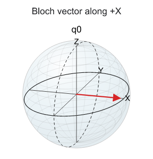

手动传入三维向量适合解释 Bloch 球方向；从线路或状态对象绘图时，应优先使用 `plot_bloch_multivector`，避免手动计算向量时引入约定错误。

---

## 查看密度矩阵结构

`plot_state_city` 展示密度矩阵的实部和虚部。它适合检查态中是否存在相干项，以及混态/纯态结构是否符合预期。

```python
plot_state_city(
    state,
    title="State city for |+>",
    output_path="assets/plus_state_city.png",
)
```

生成的 state city 图如下：

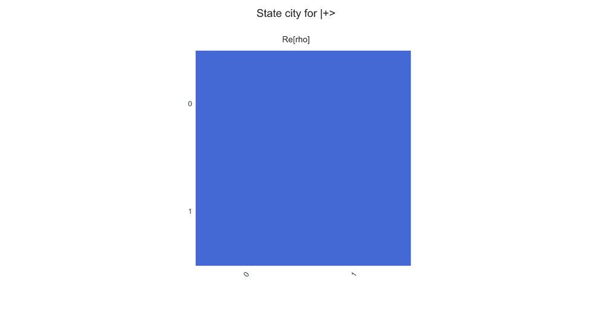

对于 `|+>`，密度矩阵中非对角元不为零，表示 `|0>` 和 `|1>` 之间存在相干性。

---

## 查看 Pauli 展开

Pauli vector 展示状态在 Pauli 基下的期望值，适合连接到 VQE、QAOA、误差诊断和可观测量分析。

```python
plot_state_paulivec(
    state,
    title="Pauli vector for |+>",
    output_path="assets/plus_paulivec.png",
)
```

生成的 Pauli vector 图如下：

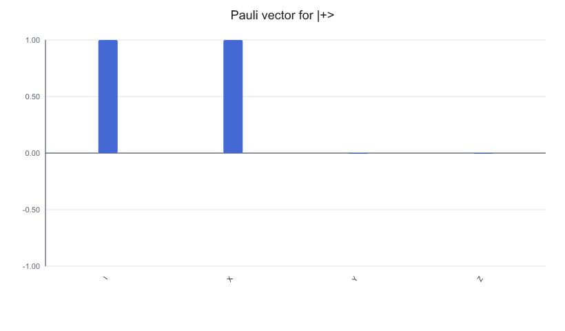

对 `|+>` 态，`X` 方向期望值应为主导项。这类图比直接看复数振幅更适合解释物理含义。

---

## Statevector 与 DensityMatrix 使用同一套状态图

同一个纯态也可以写成密度矩阵。Cqlib 的状态可视化接口接受 `Statevector` 和 `DensityMatrix`，因此可以用同一段绘图逻辑比较理想态和含噪态。

```python
from cqlib.qis import DensityMatrix

density = DensityMatrix(1)
density.apply_h(0)

plot_state_city(density, output_path="assets/plus_density_city.png")
plot_state_paulivec(density, output_path="assets/plus_density_paulivec.png")
```

密度矩阵输入生成的图如下：

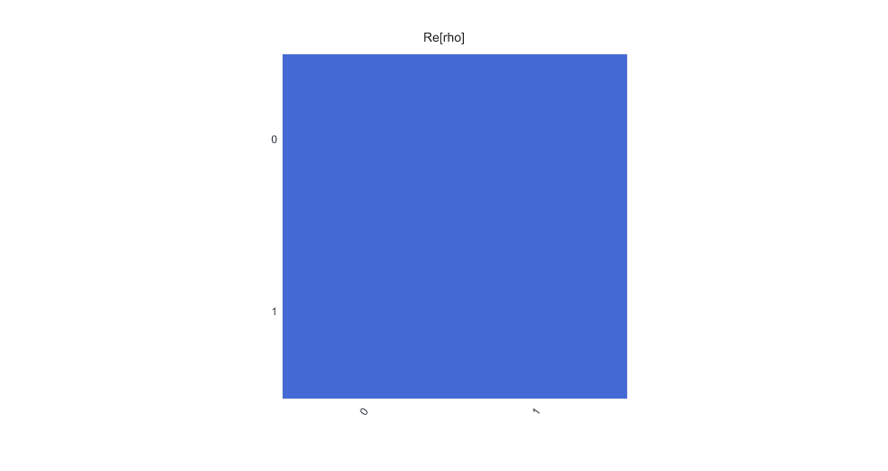

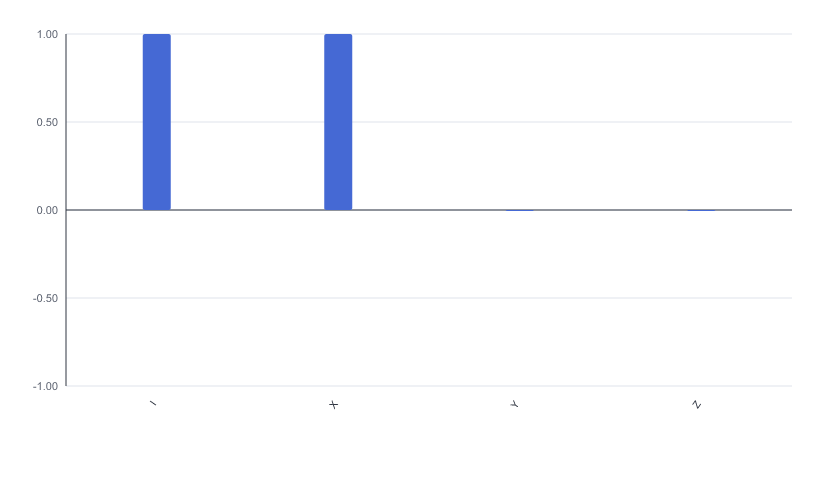

使用状态图时，需要先明确输入是状态向量还是密度矩阵。前者通常表示理想纯态，后者可以表达混态和噪声后的状态。

下面构造一个简单混态，展示 state city 如何暴露对角结构：

```python
mixed = DensityMatrix.from_density_matrix(
    1,
    [
        0.7 + 0.0j,
        0.0 + 0.0j,
        0.0 + 0.0j,
        0.3 + 0.0j,
    ],
)

plot_state_city(
    mixed,
    title="Mixed one-qubit state",
    output_path="assets/mixed_state_city.png",
)
```

混态的 state city 如下：

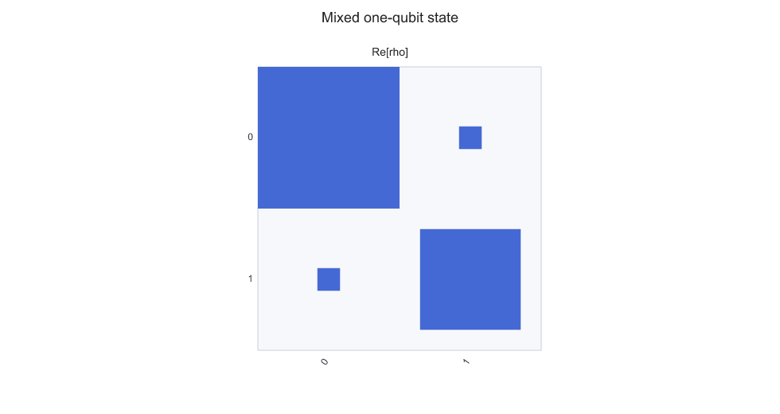

这个例子没有非对角相干项，因此图中主要信息集中在对角元。用它和 `|+>` 的 state city 对比，可以直观看出相干态与经典概率混合的差别。

---

## 多比特状态的阅读方式

Bloch multivector 对多比特态会为每个 qubit 绘制一个约化 Bloch 向量。以 Bell 态为例：

```python
from cqlib import Circuit
from cqlib.qis import Statevector
from cqlib.visualization import plot_bloch_multivector, plot_state_city

bell = Circuit(2)
bell.h(0)
bell.cx(0, 1)

bell_state = Statevector.from_circuit(bell)

plot_bloch_multivector(bell_state, output_path="assets/bell_bloch_multivector.png")
plot_state_city(bell_state, output_path="assets/bell_state_city.png")
```

Bell 态的约化 Bloch 图如下：

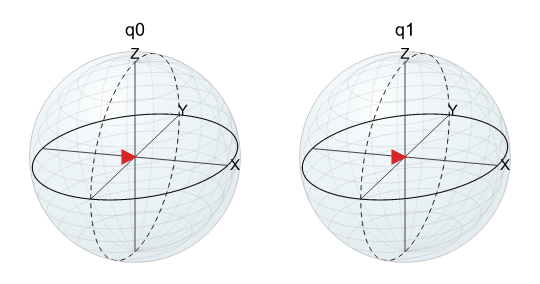

Bell 态的 state city 图如下：

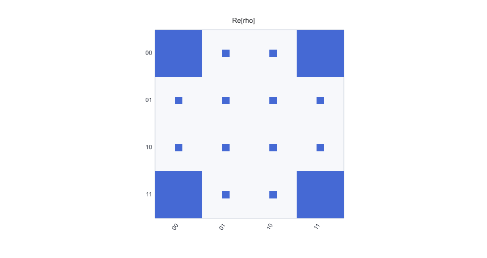

对于最大纠缠态，单个 qubit 的约化态可能看起来接近混合态。此时不要只凭单个 Bloch 球判断全局态是否“没有信息”，应结合 state city、概率分布或纠缠指标一起分析。

如果只是阅读每个 qubit 的局部 Bloch 向量，Bell 态会显得“没有方向”；但 state city 仍能展示全局密度矩阵中的相关结构。因此，多比特态通常需要结合多种状态图一起判断。

---

## 检查多比特标签顺序

多比特 state city 和 Pauli vector 的横轴标签依赖 bit order。需要与论文、硬件后端或其他 SDK 的显示习惯对齐时，可以用 `reverse_bits=True` 生成对照图。

下面构造一个非对称的 2-qubit 对角密度矩阵，使 `01` 和 `10` 的权重不同：

```python
asymmetric = DensityMatrix.from_density_matrix(
    2,
    [
        0.05 + 0.0j, 0.0 + 0.0j, 0.0 + 0.0j, 0.0 + 0.0j,
        0.0 + 0.0j, 0.15 + 0.0j, 0.0 + 0.0j, 0.0 + 0.0j,
        0.0 + 0.0j, 0.0 + 0.0j, 0.75 + 0.0j, 0.0 + 0.0j,
        0.0 + 0.0j, 0.0 + 0.0j, 0.0 + 0.0j, 0.05 + 0.0j,
    ],
)

plot_state_city(
    asymmetric,
    title="Asymmetric basis weights",
    output_path="assets/asymmetric_state_city.png",
)
plot_state_city(
    asymmetric,
    reverse_bits=True,
    title="Asymmetric basis weights, reversed bits",
    output_path="assets/asymmetric_state_city_reverse_bits.png",
)
```

默认显示顺序下的 state city：

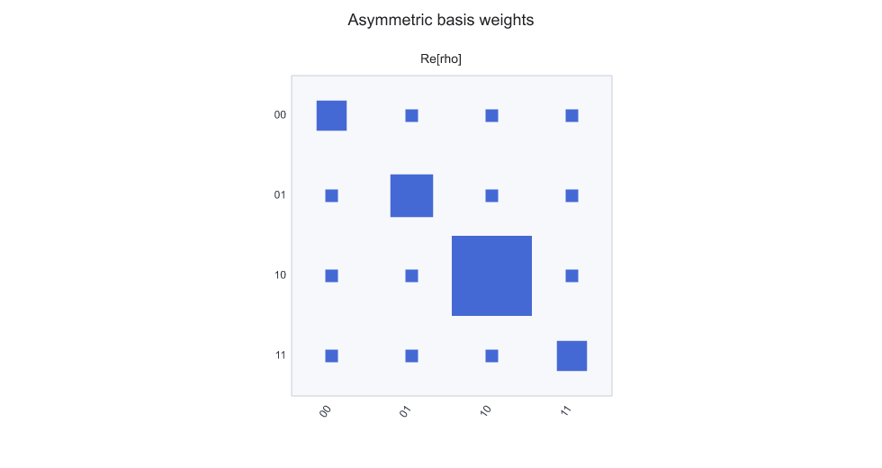

反转显示顺序后的 state city：

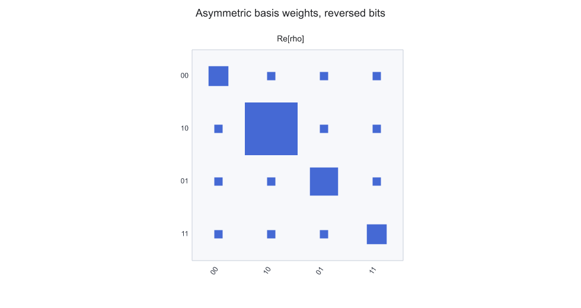

`reverse_bits=True` 不会改变状态本身，只改变图中的 basis label 显示顺序。对于这个非对称状态，`01` 和 `10` 权重不同，因此标签反转会直接影响读图结论。

Pauli vector 也可以用同样方式生成对照：

```python
plot_state_paulivec(
    asymmetric,
    title="Asymmetric Pauli vector",
    output_path="assets/asymmetric_paulivec.png",
)
plot_state_paulivec(
    asymmetric,
    reverse_bits=True,
    title="Asymmetric Pauli vector, reversed bits",
    output_path="assets/asymmetric_paulivec_reverse_bits.png",
)
```

默认 Pauli vector：

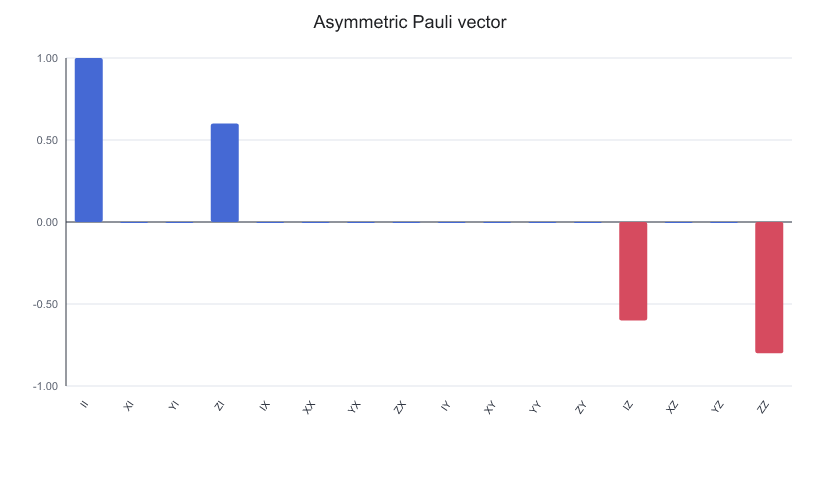

反转显示顺序后的 Pauli vector：

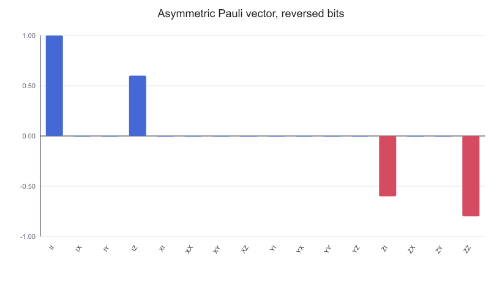

在多比特状态图中，先确认 basis label 和 Pauli string 的显示顺序，再解释相干项、对角权重或 Pauli 期望值。

---

## 生成报告用状态图

状态图用于报告或演示材料时，可以控制画布尺寸、颜色和透明度。下面以同一个非对称密度矩阵为例，生成更紧凑的 Pauli vector：

```python
plot_state_paulivec(
    asymmetric,
    figsize=(5.0, 3.0),
    color=["#2563eb", "#dc2626"],
    alpha=0.85,
    title="Asymmetric Pauli vector for report",
    output_path="assets/asymmetric_paulivec_report.png",
)
```

生成的报告用 Pauli vector 如下：

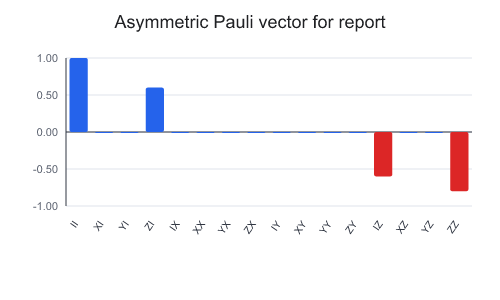

这种图适合放入版面空间有限的报告。调试阶段仍建议先使用默认图，以减少配色、透明度和尺寸设置对读图的干扰。

---

## 状态图检查要点

- 确认状态来自线路模拟、直接构造还是噪声演化；
- 单比特态优先用 Bloch 图解释方向；
- 多比特纠缠态不要只看单 qubit Bloch 向量；
- 多比特图需要先确认 bit order、basis label 和 Pauli string 顺序；
- 密度矩阵图适合解释相干项和混态；
- Pauli vector 适合连接到可观测量和期望值。
- 与结果图不同，状态图展示的是模拟或构造出的量子态本身；真实硬件通常只能直接给出采样结果，除非另有层析或估计流程。

---

## 下一步

- [可视化执行结果](6_result_visualization.md)：对比状态图和采样结果，区分模拟态结构与实际 bitstring 分布。
- [Notebook 与文档集成](3_notebook_and_docs.md)：把状态图和生成代码保存到可重复运行的文档资产目录中。
- [复杂线路的可视化策略](4_visualization_practices.md)：回到线路结构，检查状态图中的异常是否来自门顺序、映射或模块展开。
