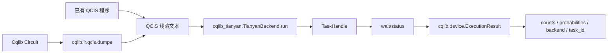
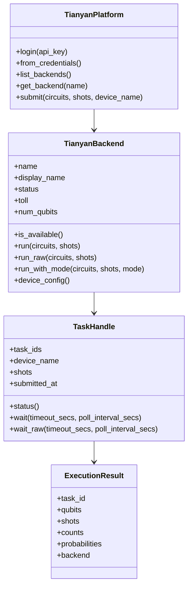

# 天衍量子云平台客户端总览

`cqlib-tianyan` 是 Cqlib 生态中用于连接天衍量子云平台的客户端库。它的职责不是构建量子线路本身，而是把已经准备好的量子线路提交到云端量子后端，并把云端返回的任务结果转换为 Cqlib 统一的 `ExecutionResult` 对象。

从使用链路看，它处在“线路构建 / IR 转换”和“云端执行 / 结果获取”之间：



## 1. 模块定位

`cqlib-tianyan` 主要提供以下能力：

| 能力 | 对应对象 | 说明 |
|---|---|---|
| 平台认证 | `TianyanPlatform.login`、`from_credentials` | 使用 API Key 登录，支持本地凭据保存和自动刷新 |
| 后端发现 | `list_backends`、`get_backend` | 获取可用量子后端、设备状态、计费类型、比特数 |
| 设备配置 | `TianyanBackend.device_config` | 下载拓扑、校准、读出误差等设备信息，返回 `cqlib.device.Device` |
| 任务提交 | `run`、`run_raw`、`run_with_mode`、`submit` | 提交 QCIS 线路，支持批量提交 |
| 结果获取 | `TaskHandle.status`、`wait`、`wait_raw` | 查询任务状态，阻塞等待结果，返回 Cqlib 统一结果对象 |
| 读取误差矫正 | `CalibrationMode` | 根据设备校准数据对测量计数做读取误差矫正 |

## 2. 与 Cqlib 其他模块的关系

`cqlib-tianyan` 与 Cqlib 核心模块的关系如下：

| 模块 | 在天衍执行链路中的作用 |
|---|---|
| `cqlib.circuit` | 构建本地量子线路 |
| `cqlib.ir.qcis` | 把 `Circuit` 转为 QCIS 文本，或加载已有 QCIS 文本 |
| `cqlib_tianyan` | 登录平台、选择后端、提交 QCIS、轮询结果 |
| `cqlib.device` | 承载设备配置和执行结果，例如 `Device`、`ExecutionResult` |
| `cqlib.visualization` | 提交前查看线路结构，排查线路是否符合预期 |

推荐工作流：

```text
Circuit 构建
-> QCIS 导出
-> Tianyan 后端提交
-> TaskHandle 等待结果
-> ExecutionResult 分析
```

## 3. 安装与环境

Python 包名为 `cqlib-tianyan`，导入模块名为 `cqlib_tianyan`。

```bash
pip install cqlib-tianyan
```

如果从源码开发安装：

```bash
cd crates/binding-python
maturin develop
```

需要同时安装 `cqlib`，因为天衍客户端返回的结果对象是 `cqlib.device.ExecutionResult`，设备配置对象是 `cqlib.device.Device`。

## 4. 最小示例

```python
import os
from cqlib_tianyan import TianyanPlatform

platform = TianyanPlatform.login(os.environ["TIANYAN_API_KEY"])
backend = platform.get_backend("tianyan-287")

qcis = "H Q1\nM Q1"
task = backend.run([qcis], shots=1000)

results = task.wait(timeout_secs=120.0, poll_interval_secs=5.0)
result = results[0]

print(result.task_id)
print(result.counts)
print(result.probabilities)
```

这个示例做了四件事：

1. 使用环境变量中的 API Key 登录平台。
2. 选择一个后端设备。
3. 提交一条 QCIS 线路。
4. 等待任务完成并读取测量计数。

## 5. 核心对象关系



## 下一步

- [认证与配置](1_auth_config.md)：学习 API Key 登录、凭据保存、自定义域名和配置项。
- [后端与设备配置](2_backend_device.md)：学习后端列表、状态判断、设备拓扑和校准配置。
- [任务提交与结果获取](3_task_result.md)：学习提交 QCIS、批量任务、轮询和结果对象。
- [QCIS 与 IR 联动](4_qcis_ir_workflow.md)：学习如何从 Cqlib `Circuit` 导出 QCIS 并提交到天衍。
- [读取误差矫正](5_readout_mitigation.md)：学习 `CalibrationMode` 和矫正/原始结果的区别。
