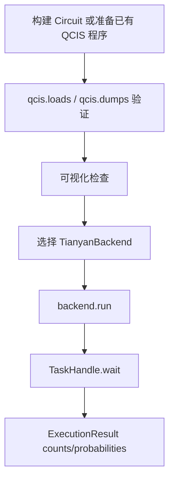

# QCIS 与 IR 联动

天衍平台任务提交使用 QCIS 线路文本。因此，在 Cqlib 中通常有两种方式准备提交内容：

- 使用已有 QCIS 程序文本，例如硬件侧工具链、历史实验文件或外部系统生成的 QCIS。
- 先用 `cqlib.circuit.Circuit` 构建线路，再通过 `cqlib.ir.qcis.dumps` 导出 QCIS。

本页重点说明第二种方式，因为它能把 Cqlib 的线路构建、可视化、IR 转换和天衍执行串成一个完整流程。

## 1. 从 Circuit 到 QCIS

```python
from cqlib import Circuit
from cqlib.ir import qcis

circuit = Circuit(2)
circuit.h(0)
circuit.cz(0, 1)
circuit.measure(0)
circuit.measure(1)

qcis_text = qcis.dumps(circuit)
print(qcis_text)
```

可能输出：

```text
H Q0
CZ Q0 Q1
M Q0
M Q1
```

## 2. 提交导出的 QCIS

```python
import os
from cqlib import Circuit
from cqlib.ir import qcis
from cqlib_tianyan import TianyanPlatform

circuit = Circuit(2)
circuit.h(0)
circuit.cz(0, 1)
circuit.measure(0)
circuit.measure(1)

qcis_text = qcis.dumps(circuit)

platform = TianyanPlatform.login(os.environ["TIANYAN_API_KEY"])
backend = platform.get_backend("tianyan-287")

task = backend.run([qcis_text], shots=1000)
results = task.wait(timeout_secs=120.0)

print(results[0].counts)
```

## 3. 提交前先验证 QCIS

如果 QCIS 来自外部系统、历史实验文件或人工编写的程序文本，推荐先用 Cqlib IR 解析一次：

```python
from cqlib.ir import qcis

qcis_text = "H Q1\nM Q1"
circuit = qcis.loads(qcis_text)

print(circuit.num_qubits)
print(len(circuit.operations))
```

如果 `qcis.loads` 失败，说明文本本身可能不符合 Cqlib 当前 QCIS 支持范围，不建议直接提交到云端。

## 4. 可视化检查

提交前可以用 Cqlib 可视化模块查看线路：

```python
from cqlib.ir import qcis
from cqlib.visualization import draw_text

circuit = qcis.loads("H Q1\nM Q1")
print(draw_text(circuit))
```

这一步适合排查：

- 量子比特编号是否正确。
- 门顺序是否正确。
- 测量是否存在。
- 线路是否和预期一致。

## 5. QCIS 门集边界

`qcis.dumps(circuit)` 会拒绝无法表示为 QCIS 的线路。常见情况：

| 情况 | 说明 | 处理方式 |
|---|---|---|
| 自定义 `CircuitGate` | QCIS 不直接表达用户自定义门 | 先 `decompose()` |
| 任意矩阵 `UnitaryGate` | QCIS 是门指令文本，不保存任意矩阵 | 先分解到基础门 |
| 复杂控制流 | QCIS 不表达通用 classical control flow | 改用其他格式或先编译展开 |
| 普通 identity gate | QCIS 的 `I Qn t` 表示 delay，不是普通恒等门 | 不要把普通 I 当成 QCIS delay |
| 全局相位 | 硬件指令一般不需要全局相位 | 提交前去除或忽略 |

## 6. 物理比特编号

天衍 QCIS 使用物理比特编号，例如：

```text
H Q1
M Q1
```

这里的 `Q1` 是物理比特编号，不一定等同于本地逻辑线路中的第 1 个逻辑比特。实际提交前需要确认目标设备拓扑和可用比特。

如果你直接用 `Circuit(2)` 构造本地线路，再导出 QCIS，默认会得到 `Q0`、`Q1`。如果目标设备希望使用特定物理比特，例如 `Q1`、`Q8`，需要在构造或映射阶段显式处理。

手写指定物理比特的 QCIS：

```python
qcis_text = "H Q1\nH Q8\nCZ Q1 Q8\nH Q8\nM Q1\nM Q8"
```

这个示例使用 `H + CZ + H` 在目标比特上等价实现 CNOT 结构。

## 7. 与 OpenQASM 的关系

如果已有 OpenQASM 线路，可以通过 Cqlib IR 先转为 `Circuit`，再导出 QCIS：

```python
from cqlib.ir import qasm3, qcis

qasm3_text = """
OPENQASM 3.0;
include "stdgates.inc";
qubit[2] q;
h q[0];
cz q[0],q[1];
"""

circuit = qasm3.loads(qasm3_text)
qcis_text = qcis.dumps(circuit)
```

注意：只有当 OpenQASM 线路中的门和语义能被 QCIS 表达时，转换才会成功。

## 8. 推荐执行链路



## 9. 工程建议

- 对关键实验保存原始 `Circuit`、导出的 QCIS 和最终结果。
- 使用外部 QCIS 程序文本时，先用 `qcis.loads` 解析验证。
- 使用物理比特前，先查看 `backend.device_config()`。
- 如果 QCIS 导出失败，不要强行字符串拼接，优先回到线路分解或编译阶段处理。
- 对云端任务保留 `task.task_ids`，方便后续追踪。

## 下一步

- [读取误差矫正](5_readout_mitigation.md)：基于设备校准数据获取矫正后的测量结果。
- [QCIS 格式说明](../1_ir/1_qcis.md)：了解 Cqlib 对 QCIS 指令、导入和导出的支持范围。
